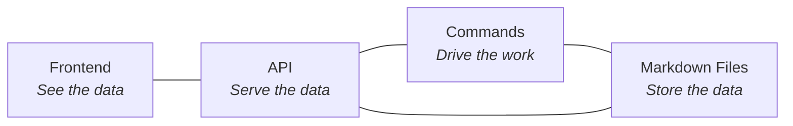
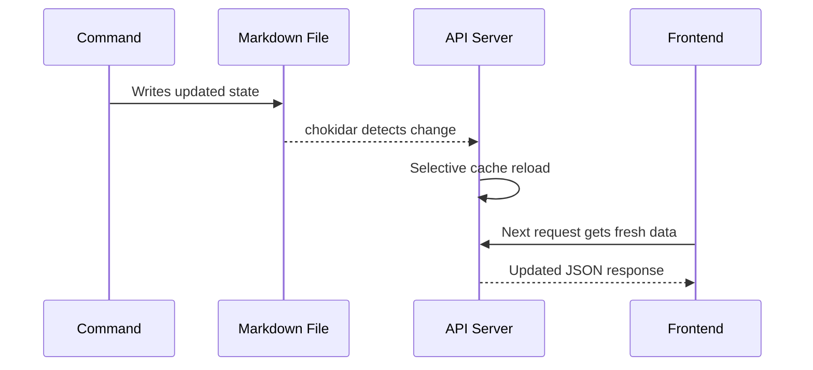
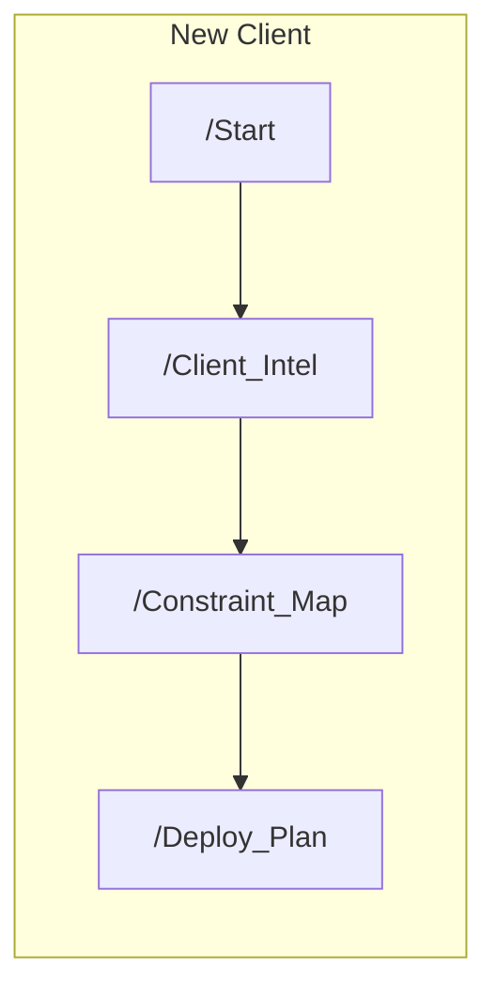
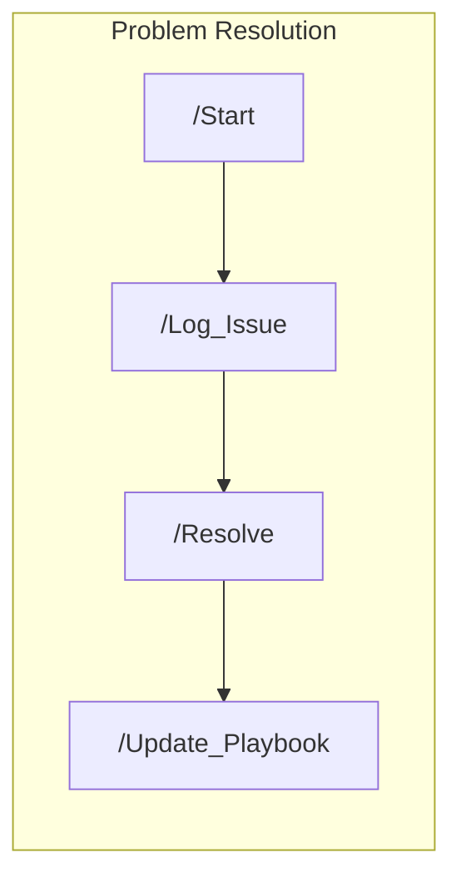
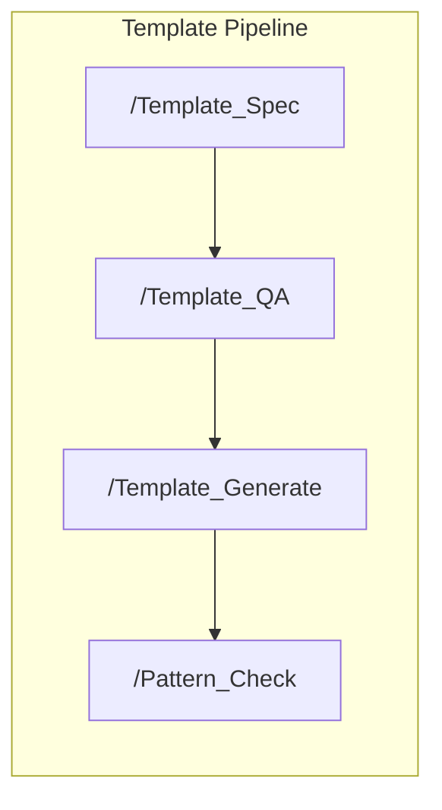
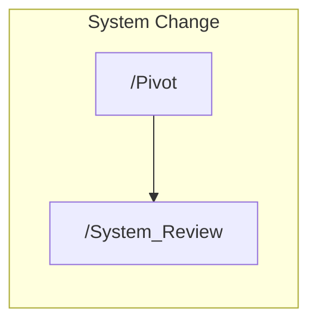
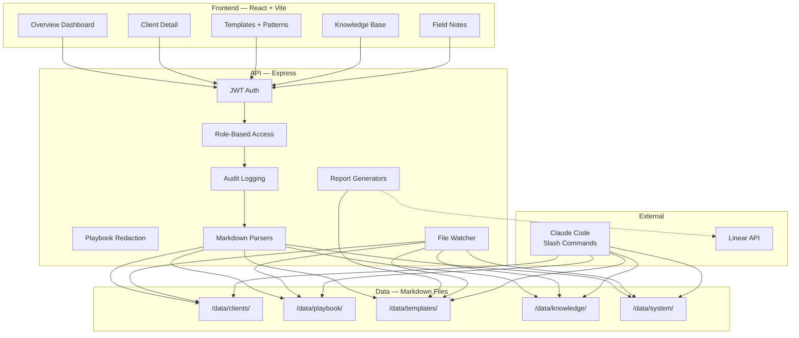
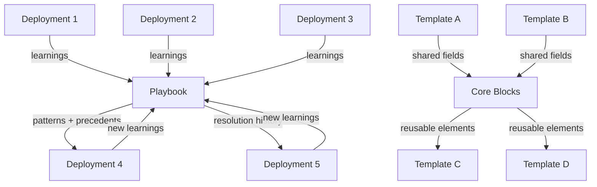
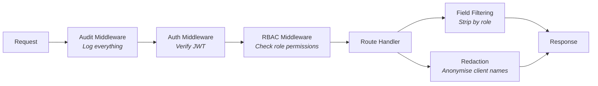

# DS-OS — Deployment Strategy Operating System

A system that runs the full lifecycle of enterprise AI deployments — from first contact through live implementation, issue resolution, and expansion. Built for the Testing, Inspection, and Certification (TIC) industry. Every deployment compounds intelligence. The second client onboards with one deployment's learnings. The fifth starts with four. Nothing stays in someone's head.

**Live demo:** [ds-os.onrender.com](https://ds-os.onrender.com)

---

## Table of Contents

- [The Problem](#the-problem)
- [Three Interfaces](#three-interfaces)
- [Frontend](#frontend)
- [API](#api)
- [Command System](#command-system)
- [Architecture](#architecture)
- [Data Model](#data-model)
- [Security](#security)
- [Tech Stack](#tech-stack)
- [Local Setup](#local-setup)
- [Deployment](#deployment)
- [Simulated Data](#simulated-data)

---

## The Problem

Enterprise AI deployments in TIC are bespoke. Every client has different inspection types, regulatory standards, report formats, user workflows, and compliance requirements. Each deployment requires deep customisation that doesn't scale linearly with headcount.

DS-OS systematises the repeatable parts so the genuinely custom work gets human judgment, and everything else runs automatically. Resolution patterns from one client inform the next. Templates surface reusable elements across inspection types. The playbook grows with every deployment.

By the tenth deployment, the system carries nine deployments of proven patterns, resolution precedents, and validated methods. The bespoke layer shrinks. The velocity increases.

---

## Three Interfaces

DS-OS operates through three layers that work together:



| Layer | What it does | Who uses it |
|-------|-------------|-------------|
| **Frontend** | Interactive dashboard — deployments, clients, templates, knowledge base, playbook | Everyone on the team, role-filtered |
| **API** | Express server that parses markdown into JSON, enforces auth and RBAC, watches for live changes | Frontend, integrations |
| **Commands** | Claude Code slash commands that execute deployment operations and write state | Deployment Strategist |

The frontend reads. The commands write. The API bridges them. All three share the same markdown files as the single source of truth.

---

## Frontend

A React dashboard deployed at [ds-os.onrender.com](https://ds-os.onrender.com). Every page pulls live data from the API, which reads directly from markdown files. When a command updates a file, the API cache refreshes and the frontend reflects the change.

### Overview Dashboard

The entry point. Shows the state of all deployments at a glance.

- **Stats bar** — active deployments, average onboarding time, revenue at risk, pending adoption, templates per client
- **Deployment table** — every client with phase, health, adoption %, open issues, days in phase
- **Priority queue** — algorithmically ranked actions based on renewal proximity, adoption gaps, unresolved blockers, and commercial signals
- **Signal feed** — real-time event stream combining client interactions, system changes, and commercial triggers (renewal warnings, expansion criteria met, low-adoption-by-type alerts)

### Client Detail

Deep view into any single client. Six tabs covering every dimension of the deployment:

| Tab | Contents |
|-----|----------|
| **Overview** | Profile, deployment state, phase, features live, adoption %, health indicator |
| **Constraint Map** | User types, current tools, friction points, product-fit matrix |
| **Deployment Plan** | Method, feature sequence, timeline, milestones, risk flags |
| **Issues** | Full issue log with ID, status, classification, severity, resolution |
| **Interactions** | Timestamped history of every significant touchpoint |
| **Stakeholders** | Key people, what they care about, communication style, trust level |

What you see depends on your role. A Deployment Strategist sees everything. An Account Executive sees commercial and stakeholder data. A Forward Deployed Engineer sees technical fields and issues. Field-level filtering is enforced at the API layer.

### Templates

The template specification library with commercial context.

- **Template list** — every inspection template with type, standard, status, field count, and revenue context (which clients depend on it, contract value at stake)
- **Pattern detection grid** — visual matrix showing field overlaps across templates, reusable elements, and scalability signals
- **Core blocks** — shared field groups extracted from multiple templates. Update a core block, and every linked template gets flagged for review
- **Report generation** — generate PPTX and PDF reports directly from template specs with themed formatting
- **Edit requests** — flag template sections for fixes, auto-creates a Linear issue with full context

### Knowledge Base

Seven interactive sections of industry and product intelligence:

- Scope product capabilities and feature map
- Inspection types — process, fields, instruments, standards
- Regulatory standards — governing bodies, classification systems, report requirements
- Report anatomy — universal report skeleton, variations, quality criteria
- Client segmentation — type definitions, expected behaviours, risk profiles
- Stakeholder mapping — role archetypes, motivations, communication patterns
- Success questions — diagnostic questions for every stage of deployment

Each section includes flow diagrams, expandable detail panels, and example boxes. This is the reference layer that every command reads before producing output.

### Field Notes

The playbook visualised. Deployment patterns by client type, resolution patterns by issue type, success rates per method. Client names are anonymised for non-DS roles — the patterns stay useful, the identities stay hidden.

---

## API

An Express server that parses markdown files into structured JSON and serves them over HTTP. The API is the bridge between the file-based data model and the frontend.

### Endpoints

```
Public (no auth required):
  GET  /api/health              — server status, client count, last update time
  POST /api/auth/login          — login with name + role, returns JWT (8h expiry)

Authenticated:
  GET  /api/overview            — aggregated stats, deployment table, priority queue, signal feed
  GET  /api/clients             — all clients (summary list)
  GET  /api/clients/:slug       — single client (full detail, field-filtered by role)
  GET  /api/playbook            — deployment + resolution patterns (redacted for non-DS)
  GET  /api/methods             — method registry, rules, change log
  GET  /api/system/log          — system-level change history
  GET  /api/knowledge           — all 7 knowledge sections
  GET  /api/knowledge/:section  — single knowledge section by ID
  GET  /api/templates           — all templates with metadata + revenue context
  GET  /api/templates/patterns  — pattern detection grid + overlap analysis
  GET  /api/templates/:slug     — single template (full content)
  GET  /api/audit               — audit trail (DS-only)

Template operations (DS/FDE roles):
  POST /api/templates/:slug/generate        — generate PPTX/PDF reports
  GET  /api/templates/:slug/output          — list generated files
  GET  /api/templates/:slug/output/:file    — download a generated report
  POST /api/templates/:slug/request-edit    — flag sections, creates Linear issue

Core block management (DS-only):
  GET    /api/templates/core-blocks          — list all core blocks
  POST   /api/templates/core-blocks          — create a core block
  PUT    /api/templates/core-blocks/:name    — update (flags linked templates)
  DELETE /api/templates/core-blocks/:name    — remove a core block
```

### Live File Watching

The API watches `/data/` with chokidar. When any markdown file changes — whether from a command, a manual edit, or an external tool — the relevant cache segment reloads automatically. No restart needed.



### Linear Integration

Template edit requests flow directly into Linear. When a user flags template sections for fixes, the API:

1. Saves a local JSON backup in `/data/edit_requests/`
2. Creates a Linear issue with the full context (flagged sections + comment)
3. Applies the "Template Fix" label, assigns to the team, links to the project

Works automatically when `LINEAR_API_KEY` is set. Degrades gracefully to local-only when it's not.

---

## Command System

DS-OS commands are Claude Code slash commands that execute structured deployment operations. Each command reads prior state, produces output, and writes it to the relevant file. The pipeline is fixed — customisation lives inside each step, not across the process.

### Templating

The core work commands. Build inspection template specifications from industry knowledge and client context.

| Command | What It Does |
|---------|-------------|
| `/Template_Spec` | Inspection type + context into a structured template specification |
| `/Report_Map` | Analyse a customer's existing report, map its structure |
| `/Template_QA` | Quality check a spec — fields, classification, structure, mapping |
| `/Template_Generate` | Generate PPTX + PDF reports from a template spec |
| `/Pattern_Check` | Scan the library for overlaps, reusable elements, scalability signals |

### Strategy (Deployment Operations)

The client-facing pipeline. Runs the work of deploying AI inspection automation to enterprise TIC clients.

| Command | What It Does |
|---------|-------------|
| `/Start` | Entry point — three modes: new client, existing update, or problem |
| `/Client_Intel` | Deep company research and intelligence profile |
| `/Constraint_Map` | User mapping + solutions audit + product match against capabilities |
| `/Deploy_Plan` | Full deployment plan from all prior context + playbook precedents |
| `/Log_Issue` | Problem intake: source, description, classification, severity |
| `/Resolve` | Cross-client pattern scan + past solutions + action plan |
| `/Update_Playbook` | Compound learnings into the playbook after resolution or milestone |
| `/Status` | Pull up any client's current state (read-only) |

### System Operations

Internal maintenance. Process changes, method evolution, architecture sync.

| Command | What It Does |
|---------|-------------|
| `/Pivot` | Universal method or rule change across all deployments. Shows diff before applying |
| `/System_Review` | Architecture audit. Compare actual state vs documented |
| `/Explore` | Investigation mode. Analyse a proposed change without implementing |

### Anytime

| Command | What It Does |
|---------|-------------|
| `/Ask_Right` | Generate domain-specific questions for any audience or topic |

### Pipeline Flows

Commands follow fixed sequences. Each step reads the output of the previous step before producing its own.









---

## Architecture



### How the Layers Connect

1. **Commands write state** — `/Deploy_Plan` writes a deployment plan to a client's markdown file. `/Resolve` writes a resolution to the issue log. `/Template_Spec` creates a new template file.

2. **The API watches and parses** — chokidar detects the file change, the relevant parser rebuilds the in-memory cache, and the next API request returns fresh data.

3. **The frontend displays** — React components pull from the API via react-query. Role-based filtering means each user sees only what's relevant to their function.

4. **Intelligence compounds** — `/Resolve` scans all prior clients before proposing a solution. `/Pattern_Check` identifies reusable elements across templates. `/Update_Playbook` feeds learnings back into the system. The playbook grows with every deployment.

---

## Data Model

All state lives in markdown files. No external database. Files are the database.

```
/data/
├── clients/                        # One file per client (single source of truth)
│   ├── bureau_veritas.md
│   ├── intertek.md
│   └── tuv_sud.md
├── knowledge/                      # Industry knowledge (reference, not state)
│   ├── scope_product.md            # Product capabilities, features, claims
│   ├── inspection_types.md         # Process, fields, instruments, standards
│   ├── regulatory_standards.md     # Governing bodies, classification, requirements
│   └── report_anatomy.md           # Universal report skeleton, variations
├── templates/                      # Template specification library
│   ├── _template_index.md          # Index with status tracking
│   └── [type]_[standard].md        # Individual template specs
├── playbook/
│   ├── deployment_playbook.md      # Patterns and methods by client type
│   ├── resolution_patterns.md      # Issue types and proven solutions
│   └── client_type_definitions.md  # Client segmentation rules
└── system/
    ├── system_log.md               # All system-level changes (timestamped)
    ├── method_registry.md          # Current deployment methods and rules
    └── architecture.md             # How DS-OS operates
```

### Client File Schema

Every client file follows the same structure:

| Section | Contents |
|---------|----------|
| **Profile** | Company, sector, size, inspection types, key contacts |
| **Commercial** | Contract value, term, renewal date, success criteria, economic buyer, expansion potential |
| **Deployment State** | Current phase, features live, user count, adoption %, adoption by type |
| **Constraint Map** | User types, current tools, friction points, product-fit matrix |
| **Deployment Plan** | Method, feature sequence, timeline, milestones, risk flags |
| **Issue Log** | All issues with ID, status, classification, severity, resolution |
| **Interaction History** | Timestamped entries of every significant touchpoint |
| **Stakeholder Map** | Key people, priorities, communication style, trust level |
| **Playbook Contributions** | Learnings this client has contributed to the system |

### How Intelligence Compounds



Every resolved issue feeds the playbook. Every template built surfaces reusable patterns. By the tenth deployment, the system carries nine deployments of proven patterns, resolution precedents, and validated methods. The bespoke layer shrinks. The velocity increases.

---

## Security

DS-OS handles sensitive client data during deployments. The security layer is built into the API — authentication, access control, audit logging, and data redaction are enforced on every request. Everything runs locally by default. No data leaves the machine unless you deploy it.

### What's in Place

| Feature | What It Does |
|---------|-------------|
| **JWT Authentication** | Login with name + role, receive a token (8h expiry). Every API request requires it. |
| **Role-Based Access Control** | Five roles — DS, FDE, AE, Leadership, View Only. Each role has explicit endpoint access and field visibility rules. |
| **Client Field Filtering** | Client detail responses are stripped to only the fields your role is allowed to see. DS sees everything. Everyone else gets a filtered view. |
| **Playbook Redaction** | Cross-client patterns stay useful, but client names are replaced with anonymous labels (Client A, Client B) for non-DS roles. |
| **Audit Logging** | Every API request logged — who, what, when, response time. DS can review the full trail via `/api/audit`. |
| **Data Consent** | Before any data capture begins, the system explains what will be stored and asks for explicit consent. |
| **Sensitive Path Exclusion** | Client files, session logs, and audit logs are gitignored. They never reach version control. |

### Role Permissions

| Endpoint | DS | FDE | AE | Leadership | View Only |
|----------|:--:|:---:|:--:|:----------:|:---------:|
| Overview | yes | yes | yes | yes | yes |
| Client list | yes | yes | yes | yes | no |
| Client detail | all fields | technical | commercial | overview | no |
| Playbook | raw | redacted | no | redacted | no |
| Methods | yes | yes | no | no | no |
| System log | yes | yes | no | no | no |
| Audit trail | yes | no | no | no | no |
| Templates | yes | yes | yes | yes | no |
| Report generation | yes | yes | no | no | no |
| Core blocks (write) | yes | no | no | no | no |

### Security Architecture



### Future Roadmap

Encryption at rest, password/SSO authentication, HTTPS for network deployments, GDPR compliance tooling, database migration for ACID transactions and file-level access control.

**Full security documentation:** [`SECURITY.md`](SECURITY.md) | **Technical reference:** [`api/security/REFERENCE.md`](api/security/REFERENCE.md)

---

## Tech Stack

| Layer | Technology |
|-------|-----------|
| Frontend | React 18, Vite, TypeScript, Tailwind CSS, shadcn/ui, Recharts, react-query |
| API | Express, Node.js, chokidar (file watching), jsonwebtoken (JWT) |
| Report Generation | pptxgenjs (PowerPoint), pdfkit (PDF) |
| Data | Markdown files (parsed to JSON at runtime) |
| AI Commands | Claude Code (Anthropic CLI) |
| Integration | Linear API (issue tracking) |
| Deployment | Render (free tier), UptimeRobot (keep-alive) |

---

## Local Setup

### Prerequisites

- Node.js 18+
- Git

### Install and Run

```bash
# Clone
git clone https://github.com/ronzaum/scope-dsos-demo.git
cd scope-dsos-demo

# Install API dependencies
cd api && npm install && cd ..

# Install frontend dependencies
cd frontend && npm install && cd ..

# Start the API server (port 3001)
cd api && npm start

# In a separate terminal — start the frontend dev server
cd frontend && npm run dev
```

The API serves on `http://localhost:3001`. The frontend dev server proxies API requests automatically.

### Production Build

```bash
# Build the frontend
cd frontend && npm run build && cd ..

# Start the API (serves both API and built frontend)
cd api && node server.js
```

In production mode, Express serves the built frontend from `frontend/dist/` alongside the API routes. Single process, single port, no CORS needed.

### Environment Variables

| Variable | Required | Default | Description |
|----------|----------|---------|-------------|
| `PORT` | No | `3001` | API server port |
| `DSOS_JWT_SECRET` | No | Demo fallback | JWT signing secret (set a real one in production) |
| `LINEAR_API_KEY` | No | — | Enables automatic Linear issue creation for template edit requests |
| `NODE_ENV` | No | — | Set to `production` to serve frontend from Express |

---

## Deployment

DS-OS is deployed on Render via [`render.yaml`](render.yaml):

- **Single service** — Express serves the built frontend and the API from one process
- **Build command** — installs frontend deps, runs `vite build`, installs API deps
- **Start command** — `cd api && node server.js`
- **JWT secret** — auto-generated by Render
- **Password gate** — client-side access code wraps the entire app before any API calls fire. Not a security boundary — just access control for the demo
- **Keep-alive** — UptimeRobot pings `/api/health` every 14 minutes to prevent Render's free tier from sleeping

---

## Simulated Data

**All client data in `/data/clients/` is fabricated for demonstration purposes.** Company profiles use publicly available information; all deployment data, commercial terms, issues, interactions, stakeholder details, and usage metrics are fictional. Each client file carries a visible disclaimer banner.

Knowledge base files in `/data/knowledge/` were assembled from public sources and general domain knowledge.

**The system plumbing is real.** The API reads from markdown files, watches for changes, and the frontend reflects updates in real time. Data created through DS-OS commands (templates, deployment plans, issue logs) is live and persists. Only the seed data is simulated.

### Simulated Integrations

For the demo, these integrations are represented via pre-loaded data in client files:

| Integration | How It Appears |
|-------------|---------------|
| Email | Client correspondence summaries in interaction history |
| Call transcripts | Key quotes and decisions in interaction history |
| CRM | Commercial data in each client's commercial section |
| Support tickets | Logged as issues in the issue log |
| Product usage | Feature adoption and user counts in deployment state |

In production, these would sync automatically. For the demo, the data is realistic in structure but fictional in content.
